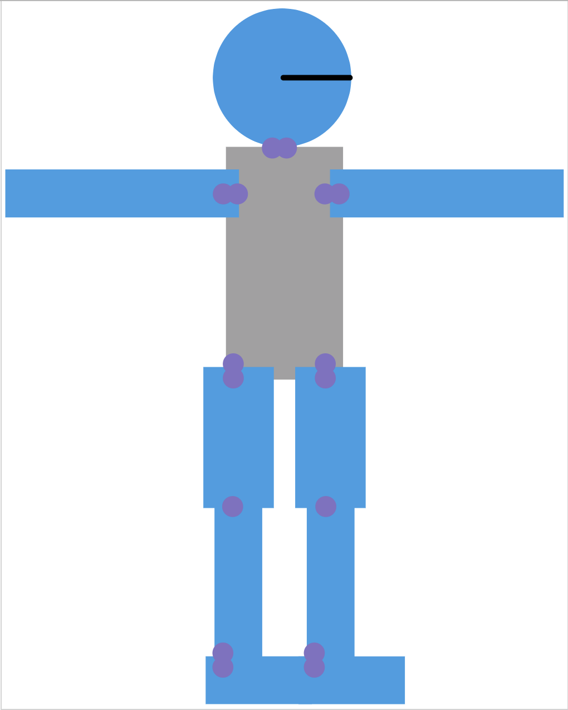

# 2D Walker
This is a gym environment for a simple 2d humanoid used for training 2 dimensional walking. The environment is implemented using OpenAI Gym and pygame.

# Humanoid Model

The humanoid has 8 joints, 1 for each foot, 1 for each knee, 1 for each hip, 1 for each arm. 

# Environment description

The environment was developed to take discrete actions with 3 possible values: increase, decrease, or do nothing. The actions are applied to the joints of the humanoid. The humanoid is then moved forward by a fixed amount. The environment is considered solved when the humanoid can reach a set distance.

# Trained Example
## 1M steps

